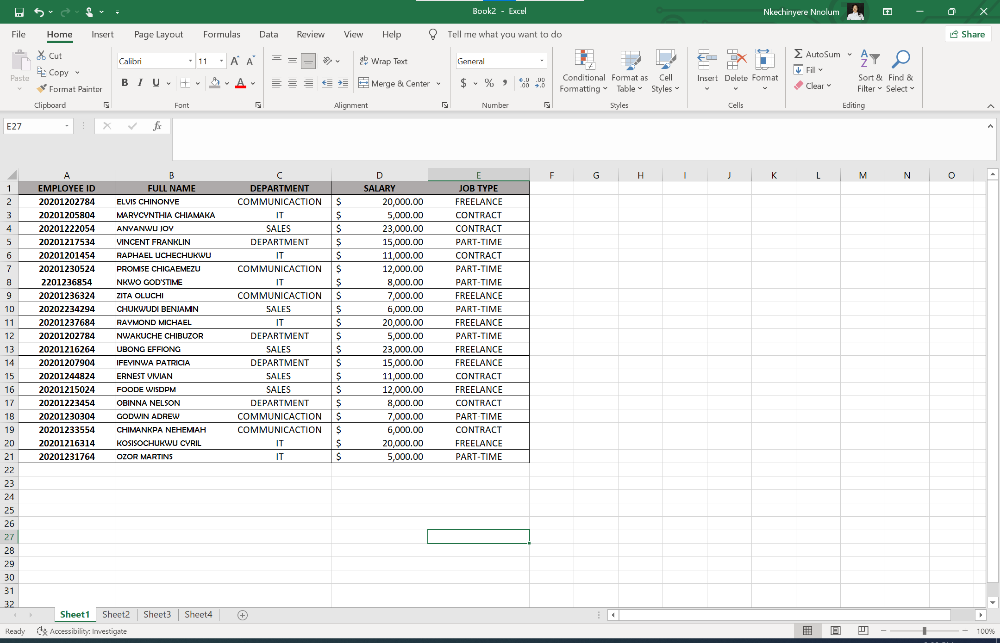
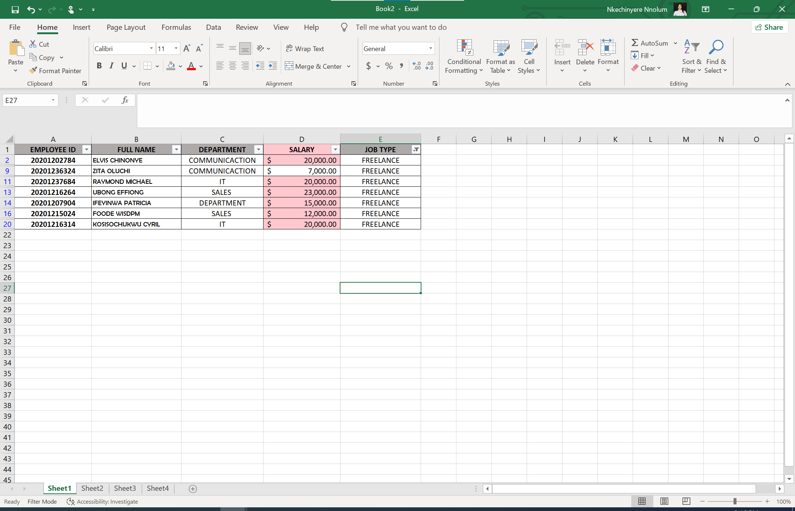
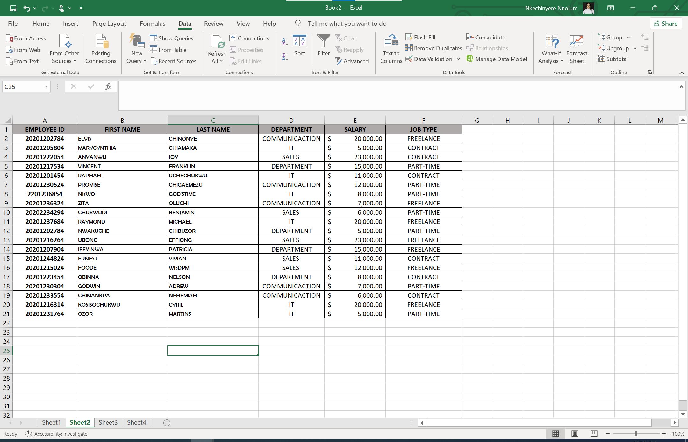
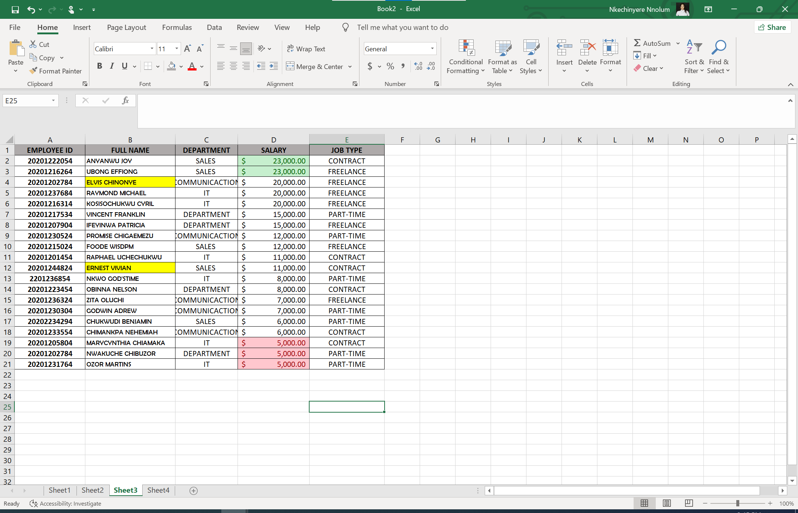
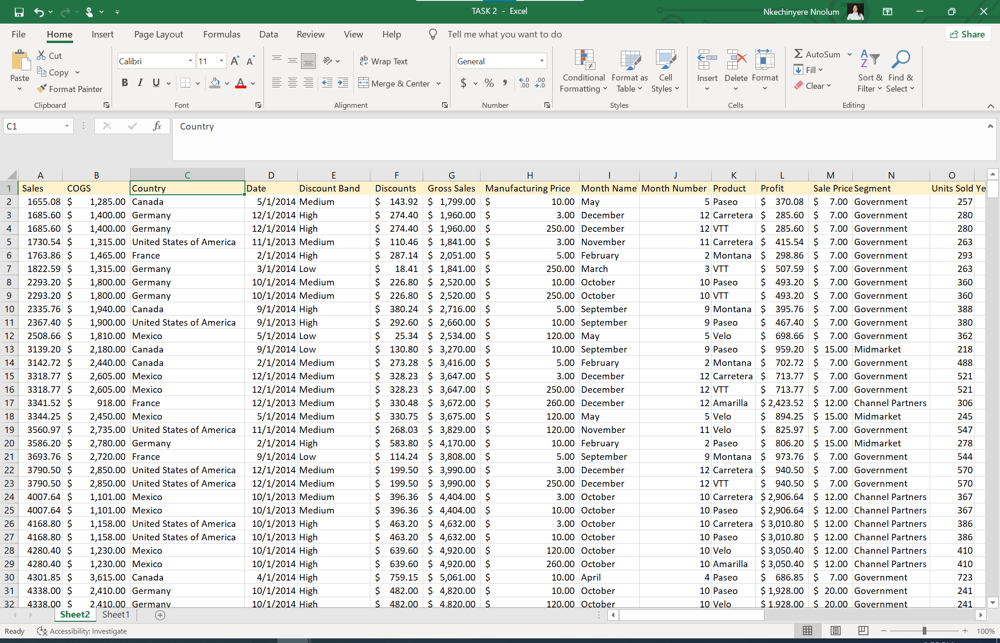
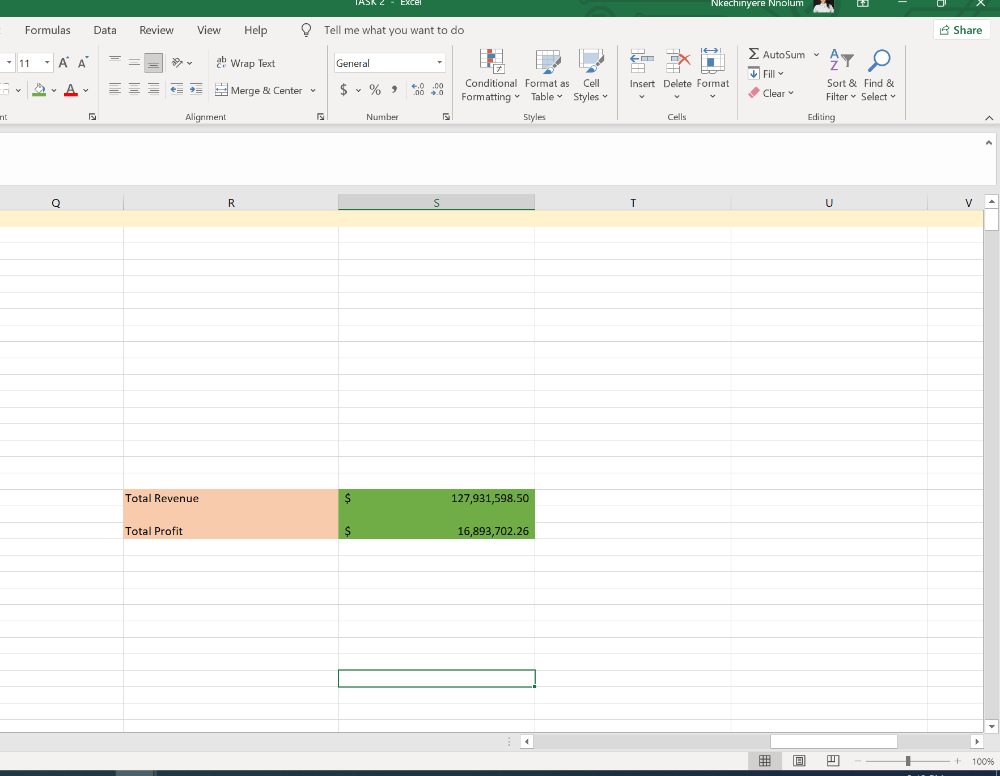
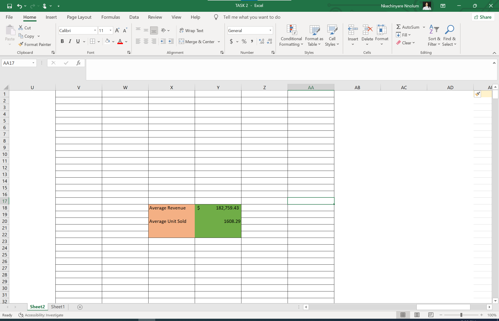
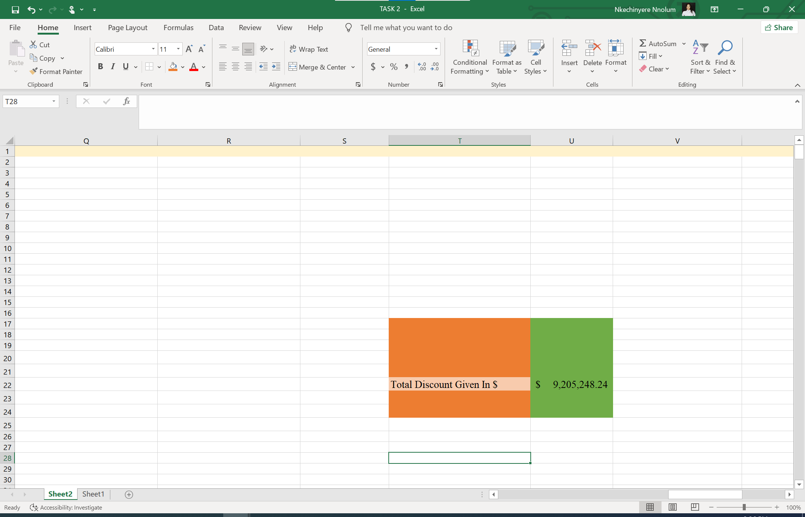
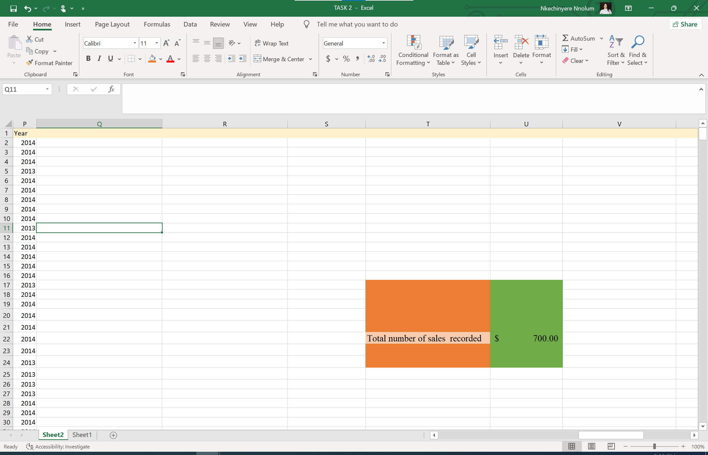

## Introduction

This is an excel data analysis, where the student is require to undergo some task to show an understanding of the excel worksheet and manipulation
The student is require to do the following;
--

# Employee Demographics
--

**_Disclaimer_**:_All data and demographic information does not represent any individual or oganisation
---
#Task 1
--
The instruction was to create twenty (20) rolls in excel worksheet, and input the employees demographics such as Employee ID, Employee Full Name, Department (IT, Communication, Sales), Salary and Job type (Part-time, Freelancer, Contract.

## Procedure
I created the rows, entered the details as required and identified the data types for each column, then copied the data and paste into sheet 2 and 3 , this is to enable me complete the outstanding tasks using the same data set

#Task 2
On sheet 1, identify the employees who are freelancers, and highlight those with salary range above $10,000.
--

----

## Procedure
--
I first added filter function to the headings, selected the Job Type column , using the filter command select only freelancers option to filter out employees who are freelancer.
Then selecting the salary column, select the conditional formatting option, select Cells greater than…, I then filled in the option with $10,000 and fill in colour with red for easy identification.

#Task 3
On sheet 2: the instructor requested that I split the employees Full Name into First and Last name and check for duplicate and highlight if there is any.

## Procedure
--
I created a new column by the right of Full Name column to accommodate the name split, I selected the full name column , then select tools option and select DATA, then select ‘text to column’ and select ‘space’ box as a delimiter, then next, general as a data type was already selected, showing how the data will appear, then select the finish command, a dialogue box appear requesting if I want to replace existing data, I selected ‘yes’ and finish by labelling the heading appropriately 
No duplicate was recorded.

#Task 4
--

Highlight the employees whose names starts with ‘E’ and format the salary column such that the highest salary has a green background and the lowest salary with a red background

## Procedure
---
I selected the full name column and selected the conditional formatting, select new rules, select format cells with …. , select specific text, select beginning with, input ‘E’, then select format to add colour, select ‘fill’ to choose desired colour fill then select OK, this returns back to the earlier interface then click OK to finish.

For the second instruction, I selected the salary column and use the sort function to sort from largest to smallest

Then using the conditional formatting to highlight the colour for the highest and lowest salary range
---
- Select conditional formatting
- Select Top/Bottom rules
- Select Top 10 and edit to reflect Top 1, and select green as the required colour formatting
- Same applies to the lowest salary range formatting
- Select conditional formatting
- Select Top/Bottom rules
- Select bottom 10 and edit as appropriate 

#ASSIGNMENT 2
--
This sales data comprises of Sales, COGS, Country, Date, Discount band, Discounts, Gross Sales, Manufacturing prices, Month name, Month number, Profit, Sales Price, Segments, Units sold and Years.
The data types for each column was identified appropriately for ease of analysis.

-

#Task 1
--

I was asked to determine the total revenue and profit generated.

## Procedure
--
To access the above question, I created  a worksheet column beside the data table with the required data to be generated.
For the total revenue, I used the ‘sum’ function to calculate cell G2 to G701 representing the gross sales column.
For the total profit, I used the sum function to sum the profit column from cell L2 to L701

#Task 2
--
Average revenue and unit sold for every order

## Procedure
--
I used the Average function and in put the cell range G2:G701 of gross sales column
For the average unit sold, I also used the Average function to calculate the  average unit sold by inputting cell O2 to O701 of the unit sold column.

#Task 3
--

Total discount given 

## Procedure
--

Using the sum function to calculate the aggregate discount in the “discount column” by summing cell F2 to F701

#Task 4
--

The total number of sales recorded

## Procedure
--

I counted the series of entry in the sales column using ‘count’ function and input cell A2 to A701 to get the total count of the sales entry.

#Task 5
--
The highest profit generated

## Procedure
---

I used the MAX function and input the cell range within the profit column L2 to L701 to pick out the maximum profit within the series of entry within the profit column

#Task 
---

Create another column named “sales range” return ‘high sale’ if the sale value is above average, otherwise return ‘low sale’

## Procedure
--

I created a column by the right of the last existing column, and label as directed, having generated the average sales by the side, I then selected the first cell below the heading and input the =IF formular, =IF cell A2>$S$17(the average cell), “High Sale”, “Low Sale”) and press the enter key. Then double tap the flash fill icon to fill appropriately, then I also highlighted the newly created ‘sale Range’ column for easy identification.

